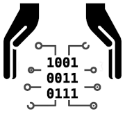
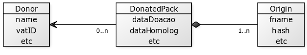

# Preserv

O presente projeto, batizado de  **Gigital-guard/Preserv**, consiste no núcleo de software e metadados do projeto de [preservação digital](https://en.wikipedia.org/wiki/Digital_preservation) de fontes primárias de dados, organizados e mantidos pelo [**Instituto ITGS**](http://addressforall.org/estatuto).

## Preservação dos dados primários

A responsabilidade sobre os dados é dividida entre o Instituto ITGS e a curadoria local de uma
jurisdição, tipicamente um país. A jurisdição `BR`, por exemplo, é relativa ao Brasil e seu repositório *git* é
o [preserv-BR](http://git.digital-guard.org/preserv-BR).

As *curadorias locais* selecionam quais dados devem ser preservados e quais os critérios mínimos de qualidade
para que um pacote de dados possa ser incorporado ao acervo de preservação.

Os dados brutos (fontes originais), por serem arquivos grandes e de baixa demanda, são mantidos em "discos frios" e armazenamento externo seguro. Seus metadados, todavia, são mantidos no *git* da respectiva jurisdição.

## Repositórios de produtos

Os dados de diversas fontes são comparados estatisticamente e consolidados pela infraestrutura do Instituto ITGS. Os resultados finais da consolidação são dados confiáveis, oferecidos ao público
como "versão teste" (*testing*) e "versão estável" (*stable*). São de responsabilidade apenas do Instituto,
mas o controle de versões é mantido com a mesma divisão de jurisdições que as fontes.

As versões *stable* são mantidas em repositórios *git* atualizados periodicamente. Eventualmente
os repositórios *git* serão segmentados em biênios ou triênios, conforme volume de dados e atualização da jurisdição,  evitando sobrecarga do *git*. Os repositórios recebem nomes com a sintaxe `digital-preservation-{jurisdição}-stable{anoInicial}`. Por exemplo  `digital-preservation-BR-stable2020` é o *git* de preservação dos produtos estáveis da jurisdição Brasil iniciado em 2020.

## Operando as eclusas de entrega de dados

A cada curadoria local existe um ou mais *técnicos responsáveis* que justamente assumem a responsabilidade
pela integridade dos dados e dão a garantia de que os dados e metadados fornecidos são consistentes
e tem origem numa doação de dados realizada pela entidade detentora dos direitos de uso, e portanto
cessionária da licença de uso aberta que acompanha os dados.

Os metadados garantem a rastreabilidade tanto da fonte como da licença fornecida. São metadados de   [proveniência](https://en.wikipedia.org/wiki/Provenance#Data_provenance), conforme a estrutura ilustrada abaixo:

A entrega de dados brutos pode ser realizada arquivo por arquivo ou "em lote", ambas pelo *técnico responsável* devidamente autenticado. A entrega em lote é realizada por protocolo SFTP, no ambiente apelidado de Eclusa.

Todo o workflow e garantia de geração de *hash* é efetuado pela Eclusa.

## Códigos-fonte da Eclusa e demais softwares

Ver [/src](/src).
