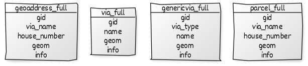
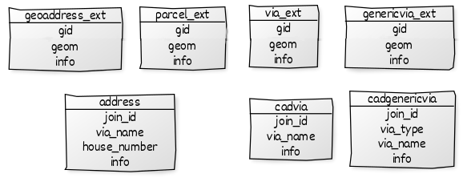
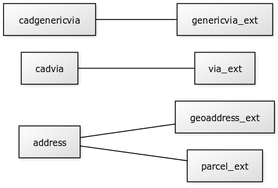

## Ilustrações

Todas as ilustrações devem ser compatíveis com HTML5, e serão reproduzidas por Markdown.

## Código-fonte

Algumas ilustrações, tipicamente diagramas, oferecem código-fonte para refazer ou documentar intensão da imagem.
Outras, como figuras SVG, devem ser armazenadas neste git como código-fonte XML.

------

A seguir o código-fonte de alguns tipos especiais de ilustração.

## Diagramas de classe

Fonte para https://yuml.me/diagram/scruffy/class/draw

### feature types

```
// ingest.feature_type
// -------------------

// Cadastral address:
  [address|join_id;via_name;house_number;info]
// Cadastral via (name of via):
  [cadvia|join_id;via_name;info]
// Cadastral generic-via (name of generic-via):
  [cadgenericvia|join_id;via_type;via_name;info]

// Geo-address point:
  [geoaddress_full|gid;via_name;house_number;geom;info]
  [geoaddress_ext|gid;join_id;geom;info]
// Via line:
  [via_full|gid;name;geom;info]
  [via_ext|gid;join_id;geom;info]
// Via line:
  [genericvia_full|gid;via_type;name;geom;info]
  [genericvia_ext|gid;join_id;geom;info]
// Parcel (urban lot) polygon:
  [parcel_full|gid;via_name;house_number;geom;info]
  [parcel_ext|gid;join_id;geom;info]
```

```
// Relationships

  [address]--------[geoaddress_ext]
  [address]--------[parcel_ext]
  [cadvia]---------[via_ext]
  [cadgenericvia]--[genericvia_ext]
```

Tipos principais, com geometria:



Tipos secundários, com informação cadastral externa:



Relacionamentos obrigatórios:

