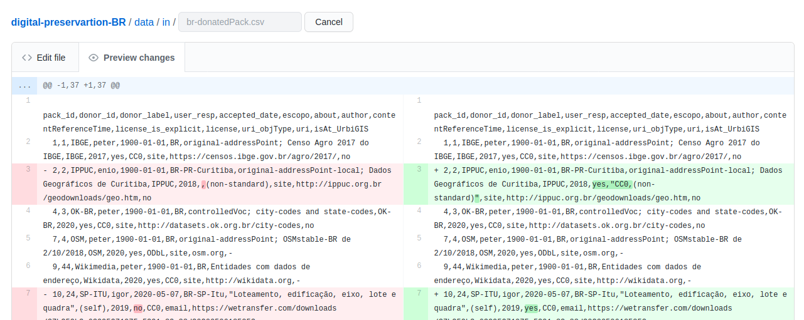

# Atualizando o git manualmente

Quem nao tem aplicativo git instalado ou nao esta acostumado a usar, pode experimentar o processo manual... Que nao deixa de ser trabalhoso, pois queremos garantir que a verificao das diferencas (diff) sera ralizada pelo ser humano.

Depois de baixar arquivos CSV da planilha Google-dcos, com *"salvar como  CSV"*, realizar o seguinte procedimento. Supor planilha `donatedPack.csv`. Na interface do portal Github realizar o seguinte passo-a-passo:

1. Navegar ate https://github.com/AddressForAll/digital-preservartion-BR/blob/master/data/in/br-donatedPack.csv

2. Clicar no icone de lapis, entrando no modo edicao

3. Selecionar tudo, deletando todo o conteudo.

4. Abrir um editor de texto decente (UTF8 linux) com texto CSV integral baixado (item 1), copiar/colar esse novo texto. Em seguida  clicar na aba superior de *"Preview changes"*... Eh o momento critico para decidir se foi tudo bem! (abaixo imagem exemplo)

5. (se tudo bem) comenar o que fez no commit e clicar no botao "commit changes"
Usuarios nao-exterts em *git* podem editar diretamente

