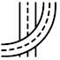
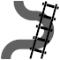
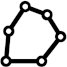
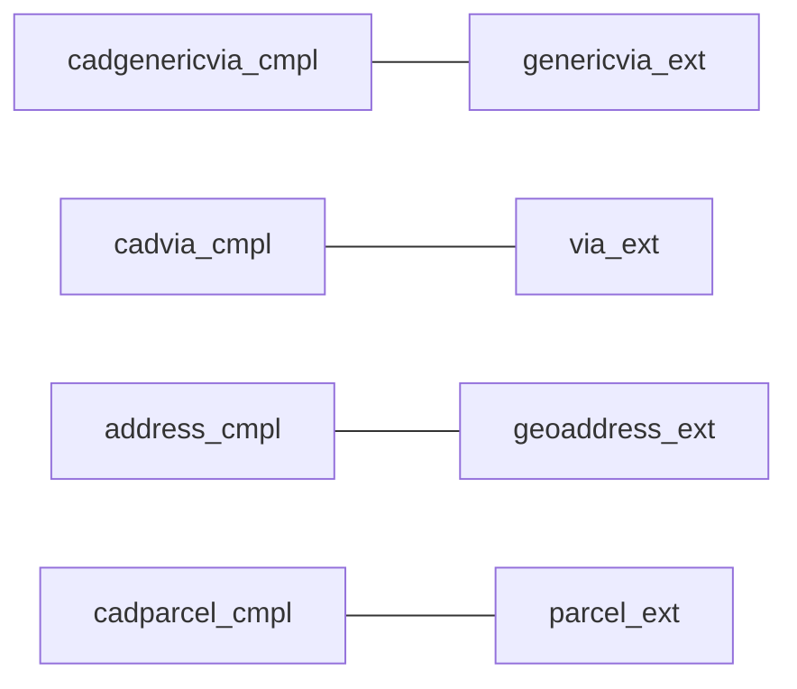

## AsIs feature types

A tabela `ingest.feature_asis` armazena todos os dados ingeridos, de "todos" os tipos (úteis para os projetos AddressForAll e OsmCodes). A tabela `ingest.feature_type` descreve cada um desses tipos. Resumidamente são:

*  **geoaddress**: Geo-endereço. Representação geográfica do endereço, como ponto.
*  **via**: Eixo de via. Logradouro representado por linha central, com nome oficial e codlog opcional.
*  **genericvia**: Ferrovia, hidrovia ou qualquer outra "via complementar generalizada" que ajude a delimitar polígonos de quadra. <!-- >&nbsp; &nbsp; Qualquer linha divisora entre quadras, incluindo córregos e outras barreiras, em meio urbano ou rural. -->
*  **building**: Polígono de edificação.
*  **parcel**: Polígono de lote.
*  **nsvia**: *Namespace* para distinguir vias duplicadas, tipicamente nome de polígono de bairro ou de loteamento.
*  **block**: Quadras ou divisões poligonais similares.

### Com geometria

Idealmente os dados fornecidos possuem geometria e todos os atributos obrigatórios, ou seja, são "full". Quando não:

* o sufixo `_ext` indica layer complementado por tabela externa (portanto sim necessita JOIN com respectivo cadastro);

* o sufixo `_none` indica que nenhum controle externo pode ser realizado e nem todos os atributos obrigatórios estão presentes.

<table role="table">
<thead>
<tr>
<th>ftid</th> <th>ftname</th> <th>geomtype</th> <th>Join</th> <th>descr</th>
</tr>
</thead>
<tbody>
<tr>
<td>21</td>
<td>geoaddress_full</td>
<td>point</td>
<td>não</td>
<td rowspan="3">Geo-endereço. Representação geográfica do endereço, como ponto.</td>
</tr>
<tr>
<td>22</td>
<td>geoaddress_ext</td>
<td>point</td>
<td>SIM</td>
</tr>
<tr>
<td>23</td>
<td>geoaddress_none</td>
<td>point</td>
<td>não</td>
</tr>

<tr>
<td>31</td>
<td>via_full</td>
<td>line</td>
<td>não</td>
<td rowspan="3">Eixo de via. Logradouro representado por linha central, com nome oficial e codlog opcional.</td>
</tr>
<tr>
<td>32</td>
<td>via_ext</td>
<td>line</td>
<td>SIM</td>
</tr>
<tr>
<td>33</td>
<td>via_none</td>
<td>line</td>
<td>não</td>
</tr>

<tr>
<td>41</td>
<td>genericvia_full</td>
<td>line</td>
<td>não</td>
<td rowspan="3">Via complementar generalizada. Qualquer linha divisora de lotes e quadras: rios, ferrovias, etc. Permite gerar a quadra generalizada.</td>
</tr>
<tr>
<td>42</td>
<td>genericvia_ext</td>
<td>line</td>
<td>SIM</td>
</tr>
<tr>
<td>43</td>
<td>genericvia_none</td>
<td>line</td>
<td>não</td>
</tr>

<tr>
<td>51</td>
<td>building_full</td>
<td>poly</td>
<td>não</td>
<td rowspan="3">Polígono de edificação.</td>
</tr>
<tr>
<td>52</td>
<td>building_ext</td>
<td>poly</td>
<td>SIM</td>
</tr>
<tr>
<td>53</td>
<td>building_none</td>
<td>poly</td>
<td>não</td>
</tr>
<tr>

<tr>
<td>61</td>
<td>parcel_full</td>
<td>poly</td>
<td>não</td>
<td rowspan="3">Polígono de lote.</td>
</tr>
<tr>
<td>62</td>
<td>parcel_ext</td>
<td>poly</td>
<td>SIM</td>
</tr>
<tr>
<td>63</td>
<td>parcel_none</td>
<td>poly</td>
<td>não</td>
</tr>

<tr>
<td>71</td>
<td>nsvia_full</td>
<td>poly</td>
<td>não</td>
<td rowspan="3">Espaço-de-nomes para vias, um nome delimitado por polígono. Tipicamente nome de bairro ou de loteamento. Complementa o nome de via em nomes duplicados (repetidos dentro do mesmo município mas não dentro do mesmo nsvia).</td>
</tr>
<tr>
<td>72</td>
<td>nsvia_ext</td>
<td>poly</td>
<td>SIM</td>
</tr>
<tr>
<td>73</td>
<td>nsvia_none</td>
<td>poly</td>
<td>não</td>
</tr>

<tr>
<td>81</td>
<td>block_full</td>
<td>poly</td>
<td>não</td>
<td rowspan="2">Quadras ou divisões poligonais similares.</td>
</tr>
<tr>
<td>82</td>
<td>block_none</td>
<td>poly</td>
<td>não</td>
</tr>
</tbody>
</table>

### Cadastral

Quando a tabela AsIs do *layer* não apresenta todos os atributos obrigatórios, deve-se recorrer a um cadastro externo com o qual fará JOIN depois de ingerida. Assim, para todo *layer* com sufixo `_ext` é ingerido também o cadastro correspondente.

Relacionamentos obrigatórios:    <!---->

<table role="table">
<thead>
<tr>
 <th>ftid</th> <th>ftname</th>  <th>Join</th> <th>descr</th>
</tr>
</thead>

<tbody>
<tr>
<td>1</td>
<td>address_cmpl</td>
<td>SIM</td>
<td rowspan="2">Endereço cadastral, representação por nome de via e numeração predial.</td>
</tr>
<tr>
<td>2</td>
<td>address_noid</td>
<td>não</td>
</tr>

<tr>
<td>6</td>
<td>cadparcel_cmpl</td>
<td>SIM</td>
<td rowspan="2">Lote cadastral (nome de parcel), complemento da geográfica. Lote representado por dados cadastrais apenas.</td>
</tr>
<tr>
<td>7</td>
<td>cadparcel_noid</td>
<td>não</td>
</tr>

<tr>
<td>11</td><td>cadvia_cmpl</td><td>SIM</td>
<td rowspan="2">Via cadastral (nome de via), complemento da geográfica. Logradouro representado por dados cadastrais apenas.</td>
</tr>
<tr>
<td>12</td><td>cadvia_noid</td><td>não</td>
</tr>

<tr>
<td>16</td>
<td>cadgenericvia_cmpl</td>
<td>SIM</td>
<td rowspan="2">Generic-via cadastral (nome de Generic-via), complemento da geográfica. Generic-via representado por dados cadastrais apenas.</td>
</tr>
<tr>
<td>17</td>
<td>cadgenericvia_noid</td>
<td>não</td>
</tr>
</thead>
</table>

-------

## housenumber_system_type

Da mais alta relevância para a correta interpretação da numeração predial e dos nomes de via dentro do sistema de descrição de endereços de um país ou divisão jurisdicional do país. Na AddressForAll foi definida a seguinte **tabela House System Type** (HST ou  `housenumber_system_type`) de definições:  

coluna | tipo | significado
-------|-------|----
`hstid` | `smallint` PRIMARY KEY NOT NULL| identificador (id) do HST 
`hstname` |`text` NOT NULL CHECK(lower(hstname)=hstname)| Rótulo curto e mnemônico do HST
`regex_sort` | `text` NOT NULL| regular expression da ordenação da numeração predial 
`description`| `text` NOT NULL|descrição

Atualmente, em 2023, temos apenas os seguintes descritores:

hstid| hstname | regex_sort|description
------|--------|------------|------
0 |metric | `[0-9]+` | integer | Distance in meters from city's origin (or similar mark). Example: BR-SP-PIR housenumbers [123, 4560]),
1 |street-metric |`[0-9]+[A-Z]? \- [0-9]+ [SNEL]?`| string | First code refers to the previous intersecting street, and the second is the distance to that intersection. Optional last letter is sort-direction. Example: `CO-DC-Bogota` housenumbers [96A -11, 12 - 34, 14A - 31 E].
2 | block-metric | `[0-9]+ \- [0-9]+` | integer function  | First number refers to the urban-block counter, and the second is the distance to the begin of the block in the city's origin order. Sort function is `$1*10000 + $2`. Example: `BR-SP-Bauru` housenumbers [30-14, 2-1890].
3 | ago-block|  | 
4 | df-block |  |  
