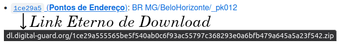

## Download das fontes primárias, por *hash*

Listagem dos arquivos referenciados em arquivos de configuração `make_conf.yaml`, ordenada por *hash*. Ver [listagem por jurisdição aqui](list-primaryData-byJurisdic.md).

A cada item são oferecidos os links de *download* (pelo *hash*) e de navegação pelos metadados. Por exemplo os pontos (da versão 1 de 2021) de Belo Horizonte estão no  arquivo de *hash* `1ce29a5` do pacote *pk012*. A Digital-guard garante por 20 anos a preservação de uma cópia física deste arquivo e, dentro do possível, garante por esse período o *download* em `DL.digital-guard.org`.

Cada um desses arquivos é depois expandido em [*layers* na base de dados](ftypes.md), conforme configurações descritas pelo  `make_conf.yaml` do respectivo pacote.

------

 - [`00f40e3` (**lotes_Itu.rar**)](http://dl.digital-guard.org/00f40e3731f0e04b8d1050a4716385f412aed5b32b560a47cc321ef4ea5413f8.rar): [BR-SP-Itu/_pk0024 Prefeitura da Estância Turística de Itu](http://git.digital-guard.org/preserv-BR/blob/main/data/SP/Itu/_pk0024.01/make_conf.yaml)
 - [`0332a2f` (**entrega_2020-10-02_recorte.zip**)](http://dl.digital-guard.org/0332a2f00b8cd344818b1b734859c44c7d6b7604d347ce1619455d9bf2629d64.zip): [BR-SP-Osasco/_pk0028 Prefeitura Municipal de Osasco](http://git.digital-guard.org/preserv-BR/blob/main/data/SP/Osasco/_pk0028.01/make_conf.yaml)
 - [`04fffd5` (**Todos os shapes**)](http://dl.digital-guard.org/04fffd56aef1c5a53cb35e5864b940b0b103e6e4752adcff7d4f30a2cb99ddb6.zip): [BR-PE-Recife/_pk0010 Prefeitura Municipal de Recife](http://git.digital-guard.org/preserv-BR/blob/main/data/PE/Recife/_pk0010.01/make_conf.yaml)
 - [`058a602` (**GDB Geodatabase**)](http://dl.digital-guard.org/058a6022054e8b3f9ba81f25f7511b58cbd4ad616b0510033b917f3f7f9f23d5.rar): [BR-MG-Contagem/_pk0009 Prefeitura Municipal de Contagem](http://git.digital-guard.org/preserv-BR/blob/main/data/MG/Contagem/_pk0009.01/make_conf.yaml)
 - [`08bc4f1` (**Vereda**)](http://dl.digital-guard.org/08bc4f124ca0a65d9eae97663eca0894d3bb4d37ead1168b767a540b68db324f.zip): [CO/_pk0003 Instituto Geográfico Agustín Codazzi](http://git.digital-guard.org/preserv-CO/blob/main/data/_pk0003.01/make_conf.yaml)
 - [`09e01c7` (**Via**)](http://dl.digital-guard.org/09e01c7ab557f61a35999b32585f72059e983600606ea2870e1520e284815165.zip): [BR-RS-CaxiasSul/_pk0069 Prefeitura Municipal de Caxias do Sul](http://git.digital-guard.org/preserv-BR/blob/main/data/RS/CaxiasSul/_pk0069.01/make_conf.yaml)
 - [`0cc1b05` (**Bairros**)](http://dl.digital-guard.org/0cc1b05163361968a5681e971c8ab1395fcca1ba4b48150a7522a90b836727e3.zip): [BR-MG-GovernadorValadares/_pk0039 Prefeitura Municipal de Governador Valadares](http://git.digital-guard.org/preserv-BR/blob/main/data/MG/GovernadorValadares/_pk0039.01/make_conf.yaml)
 - [`0f72435` (**Quadras**)](http://dl.digital-guard.org/0f724350c2511ec58873a9dcaeec51a6756f9258b2b4ecd953884198e0350cbc.zip): [BR-SP-SaoPaulo/_pk0033 Prefeitura Municipal de São Paulo](http://git.digital-guard.org/preserv-BR/blob/main/data/SP/SaoPaulo/_pk0033.01/make_conf.yaml)
 - [`121d26a` (**Codigo Postal Completa**)](http://dl.digital-guard.org/121d26a488ae9b2dd73e72e2d9495a9b892ca3068b95fe969fc64610d7615ff8.zip): [CO/_pk0005 SERVICIOS POSTALES NACIONALES S.A. 4-72](http://git.digital-guard.org/preserv-CO/blob/main/data/_pk0005.01/make_conf.yaml)
 - [`13456d8` (**Dados OpenStreetMap**)](http://dl.digital-guard.org/13456d87d099ac5b0a16203b1b41081e2a520208656f5bd963bf76d6cd738678.pbf): [UY/_pk0001 OpenStreetMap Foundation](http://git.digital-guard.org/preserv-UY/blob/main/data/_pk0001.01/make_conf.yaml)
 - [`137dc41` (**Terreno urbano e rural**)](http://dl.digital-guard.org/137dc416e70776ac57c37a4fb0cb9bedb1468e91ed73eaa656ddee91011daed7.zip): [CO/_pk0003 Instituto Geográfico Agustín Codazzi](http://git.digital-guard.org/preserv-CO/blob/main/data/_pk0003.01/make_conf.yaml)
 - [`1641b8c` (**Endereços**)](http://dl.digital-guard.org/1641b8c5fe5a2e9141939bb7353bda4fda1ea04d7a631a4d012e4759d1bf8447.zip): [BR-SP-Guarulhos/_pk0081 Prefeitura de Guarulhos](http://git.digital-guard.org/preserv-BR/blob/main/data/SP/Guarulhos/_pk0081.01/make_conf.yaml)
 - [`17c3cf7` (**Bairros**)](http://dl.digital-guard.org/17c3cf7a5fc8429b79ab09193162a627ef9d93123f7b31e1f51435ef1a8c028c.zip): [BR-RS-CaxiasSul/_pk0069 Prefeitura Municipal de Caxias do Sul](http://git.digital-guard.org/preserv-BR/blob/main/data/RS/CaxiasSul/_pk0069.01/make_conf.yaml)
 - [`1ad6696` (**Loteamentos**)](http://dl.digital-guard.org/1ad669693352407105ccdeb37a4398d62b0accb25888122c84afe2788c121c7b.rar): [BR-RS-Gravatai/_pk0017 Prefeitura Municipal de Gravataí](http://git.digital-guard.org/preserv-BR/blob/main/data/RS/Gravatai/_pk0017.01/make_conf.yaml)
 - [`1ce29a5` (**Pontos de Endereço**)](http://dl.digital-guard.org/1ce29a555565be5f540ab0c6f93ac55797c368293e0a6bfb479a645a5a23f542.zip): [BR-MG-BeloHorizonte/_pk0008 Prefeitura de Belo Horizonte](http://git.digital-guard.org/preserv-BR/blob/main/data/MG/BeloHorizonte/_pk0008.01/make_conf.yaml)
 - [`1e9014a` (**Dados OpenStreetMap**)](http://dl.digital-guard.org/1e9014a224dd457fdb88d2b151c00d3bb5d43b3ad0284b27240fbba0b2afbe96.pbf): [EC/_pk0002 OpenStreetMap Foundation](http://git.digital-guard.org/preserv-EC/blob/main/data/_pk0002.01/make_conf.yaml)
 - [`1fd83fa` (**Lotes**)](http://dl.digital-guard.org/1fd83fa52b1a8b9179f8e38703b1a33a30256f68994794404acde1ad786dac7e.zip): [BR-GO-Goiania/_pk0054 Prefeitura de Goiânia](http://git.digital-guard.org/preserv-BR/blob/main/data/GO/Goiania/_pk0054.01/make_conf.yaml)
 - [`207c82a` (**Eixos**)](http://dl.digital-guard.org/207c82a3f2fa79f943c7b393b0e4fe636ff60305302f9c64c8364851fc6bf6c2.zip): [BR-SC-Joinville/_pk0035 Prefeitura Municipal de Joinville](http://git.digital-guard.org/preserv-BR/blob/main/data/SC/Joinville/_pk0035.01/make_conf.yaml)
 - [`2137f68` (**Bairros**)](http://dl.digital-guard.org/2137f68df828ce00c276a38b969cd651efcc2f8300f9fb4a716b6fd10019862f.zip): [BR-SP-Piracicaba/_pk0041 Prefeitura Municipal de Piracicaba](http://git.digital-guard.org/preserv-BR/blob/main/data/SP/Piracicaba/_pk0041.01/make_conf.yaml)
 - [`22ecd5e` (**Pontos de endereço**)](http://dl.digital-guard.org/22ecd5ef4ca76adef213fa422d9b5e4198f0667df598c511c30e512bb10aaedd.zip): [BR-SP-SaoBernardoCampo/_pk0030 Prefeitura Municipal de São Bernardo do Campo](http://git.digital-guard.org/preserv-BR/blob/main/data/SP/SaoBernardoCampo/_pk0030.01/make_conf.yaml)
 - [`23f703b` (**Quadras**)](http://dl.digital-guard.org/23f703b7d1611ea29f53fe3bd2617a5939fe96d21453004838d7fe61064dae45.zip): [BR-SP-Piracicaba/_pk0041 Prefeitura Municipal de Piracicaba](http://git.digital-guard.org/preserv-BR/blob/main/data/SP/Piracicaba/_pk0041.01/make_conf.yaml)
 - [`2587724` (**Bairros**)](http://dl.digital-guard.org/258772459588f7941ac6eeda7c6839df02d58741cf6bc3e48825aecd60418251.zip): [BR-RS-PortoAlegre/_pk0018 Prefeitura Municipal de Porto Alegre](http://git.digital-guard.org/preserv-BR/blob/main/data/RS/PortoAlegre/_pk0018.01/make_conf.yaml)
 - [`2630981` (**Nomenclatura Domiciliaria**)](http://dl.digital-guard.org/2630981b3e7c796f23a938d8c727ed47cf890547336ead89738b96e67fe62e7a.zip): [CO-ANT-Medellin/_pk0002 Alcaldía de Medellín](http://git.digital-guard.org/preserv-CO/blob/main/data/ANT/Medellin/_pk0002.01/make_conf.yaml)
 - [`27c0c46` (**Eixos**)](http://dl.digital-guard.org/27c0c467222a668837f62e9f40ac85f94685ea50f3d655207384f2343d13f573.rar): [BR-PR-Pinhais/_pk0014 Prefeitura Municipal de Pinhais](http://git.digital-guard.org/preserv-BR/blob/main/data/PR/Pinhais/_pk0014.01/make_conf.yaml)
 - [`28ad2ba` (**Edifícios**)](http://dl.digital-guard.org/28ad2bab16b023135e52a101d2e1ddf3337806de3922599a10598b9f2131e3d2.zip): [BR-SP-Cabreuva/_pk0040 Prefeitura Municipal de Cabreúva](http://git.digital-guard.org/preserv-BR/blob/main/data/SP/Cabreuva/_pk0040.01/make_conf.yaml)
 - [`28df02b` (**Dados OpenStreetMap**)](http://dl.digital-guard.org/28df02b8889548e0913d2337ee4f4cadb0e5798e377bbc95f753d4269440526c.pbf): [VE/_pk0001 OpenStreetMap Foundation](http://git.digital-guard.org/preserv-VE/blob/main/data/_pk0001.01/make_conf.yaml)
 - [`29d68e5` (**Eixos**)](http://dl.digital-guard.org/29d68e5ce006079b06b710cc2df3aa08d6cb6934f32bc0b29fc46d3e8272ff77.rar): [BR-AC-RioBranco/_pk0042 Prefeitura Municipal de Rio Branco](http://git.digital-guard.org/preserv-BR/blob/main/data/AC/RioBranco/_pk0042.01/make_conf.yaml)
 - [`2bcdbd6` (**Quadras**)](http://dl.digital-guard.org/2bcdbd6a2ddf4fd810147a106616f404c69a9c38bc02531fe3fa9f27acab25a6.zip): [BR-MG-GovernadorValadares/_pk0039 Prefeitura Municipal de Governador Valadares](http://git.digital-guard.org/preserv-BR/blob/main/data/MG/GovernadorValadares/_pk0039.01/make_conf.yaml)
 - [`2db40c6` (**Nomenclatura Domiciliaria urbano e rural**)](http://dl.digital-guard.org/2db40c6a0a4ddc0bb0f765a9195c34b258de49b179f90cd54244406e0c62df83.zip): [CO/_pk0003 Instituto Geográfico Agustín Codazzi](http://git.digital-guard.org/preserv-CO/blob/main/data/_pk0003.01/make_conf.yaml)
 - [`2e79fdf` (**Planilha de Endereços**)](http://dl.digital-guard.org/2e79fdf013a8de68e071c2f2a9911bc98196254bc9b9f39482cb0941a146b485.zip): [BR-MG-GovernadorValadares/_pk0039 Prefeitura Municipal de Governador Valadares](http://git.digital-guard.org/preserv-BR/blob/main/data/MG/GovernadorValadares/_pk0039.01/make_conf.yaml)
 - [`305df61` (**Bairros**)](http://dl.digital-guard.org/305df61c61e90caef0a0409a09b7d01a56beb6e107ae4430188617c7058f02a1.zip): [BR-PR-Cascavel/_pk0011 Prefeitura Municipal de Cascavel](http://git.digital-guard.org/preserv-BR/blob/main/data/PR/Cascavel/_pk0011.01/make_conf.yaml)
 - [`3269bac` (**Eixos**)](http://dl.digital-guard.org/3269bacc09d450b4d7496a2bc749ece94b1f48462ba0aae70d902404256bc433.zip): [BR-SP-SaoBernardoCampo/_pk0030 Prefeitura Municipal de São Bernardo do Campo](http://git.digital-guard.org/preserv-BR/blob/main/data/SP/SaoBernardoCampo/_pk0030.01/make_conf.yaml)
 - [`350b605` (**Bairros**)](http://dl.digital-guard.org/350b605174967b94ef49ce1bbac0352dd76e2175e5eae1b8e5b730cd9950d133.zip): [BR-SP-SaoBernardoCampo/_pk0030 Prefeitura Municipal de São Bernardo do Campo](http://git.digital-guard.org/preserv-BR/blob/main/data/SP/SaoBernardoCampo/_pk0030.01/make_conf.yaml)
 - [`3984d1a` (**Quadras**)](http://dl.digital-guard.org/3984d1a48b63d858fdfbe7829e493d1c35650546eb84039a59f9008de9bc4871.zip): [BR-ES-VilaVelha/_pk0007 Prefeitura Municipal de Vila Velha](http://git.digital-guard.org/preserv-BR/blob/main/data/ES/VilaVelha/_pk0007.01/make_conf.yaml)
 - [`39d3495` (**Dados de Lotes**)](http://dl.digital-guard.org/39d34950c7c61a89cfc2b4d70b0b34a85b346b41741331009205de0f06c86805.zip): [BR-RJ-Niteroi/_pk0016 Prefeitura Municipal de Niterói](http://git.digital-guard.org/preserv-BR/blob/main/data/RJ/Niteroi/_pk0016.01/make_conf.yaml)
 - [`3b67226` (**Lotes**)](http://dl.digital-guard.org/3b67226b43d2093e81204c1ed089eafafe0ffd92ce8fe98bd8db1f45b2e3bfb1.zip): [BR-PR-Curitiba/_pk0002 Inst. de Pesquisa e Plan Urbano de Curitiba](http://git.digital-guard.org/preserv-BR/blob/main/data/PR/Curitiba/_pk0002.01/make_conf.yaml)
 - [`3c69a4b` (**Todos os arquivos**)](http://dl.digital-guard.org/3c69a4bf2fa9cce1b701968f6c970230e51ee2a656f7168f384f5066a05eaba2.zip): [BR-RS-Pelotas/_pk0080 Prefeitura Municipal de Pelotas](http://git.digital-guard.org/preserv-BR/blob/main/data/RS/Pelotas/_pk0080.01/make_conf.yaml)
 - [`3c89fd7` (**Lotes**)](http://dl.digital-guard.org/3c89fd728a33d781a60088e8b384295e92e70c96b6c9fed78bd4f36f819df67a.zip): [BR-SP-Sorocaba/_pk0031 Prefeitura Municipal de Sorocaba](http://git.digital-guard.org/preserv-BR/blob/main/data/SP/Sorocaba/_pk0031.01/make_conf.yaml)
 - [`3d4a6f5` (**Lotes**)](http://dl.digital-guard.org/3d4a6f528249d062a0bcfb18aa6c115828bb651a164617489c14017b6433c02a.zip): [BR-SC-Joinville/_pk0035 Prefeitura Municipal de Joinville](http://git.digital-guard.org/preserv-BR/blob/main/data/SC/Joinville/_pk0035.01/make_conf.yaml)
 - [`3d5bc83` (**Pontos de Endereço**)](http://dl.digital-guard.org/3d5bc83bbbfd7e28857d36e6cf9df06bcd1d9de257018d684a3dd91608c55742.zip): [BR-SP-SaoVicente/_pk0032 Prefeitura Municipal de São Vicente](http://git.digital-guard.org/preserv-BR/blob/main/data/SP/SaoVicente/_pk0032.01/make_conf.yaml)
 - [`410d02a` (**Malla Vial**)](http://dl.digital-guard.org/410d02a87e8d2955849ba644ed8830f3d6761b31f4d0dbf044d39975ffc02be1.zip): [CO-ANT-Medellin/_pk0002 Alcaldía de Medellín](http://git.digital-guard.org/preserv-CO/blob/main/data/ANT/Medellin/_pk0002.01/make_conf.yaml)
 - [`4348429` (**Inscripciones**)](http://dl.digital-guard.org/43484294f9190a3a050e097e0c106f8da16169a3e1dff9d00ea04aae6e9cbe1a.zip): [PE-CUS-Cusco/_pk0001 EPS SEDACUSCO S.A.](http://git.digital-guard.org/preserv-PE/blob/main/data/CUS/Cusco/_pk0001.01/make_conf.yaml)
 - [`437a501` (**Eixos**)](http://dl.digital-guard.org/437a5012420b1bdc748ea571eabfa0aee6154c41196fe898c383d76e61a5c5db.zip): [BR-MG-GovernadorValadares/_pk0039 Prefeitura Municipal de Governador Valadares](http://git.digital-guard.org/preserv-BR/blob/main/data/MG/GovernadorValadares/_pk0039.01/make_conf.yaml)
 - [`46329bb` (**Dados OpenStreetMap**)](http://dl.digital-guard.org/46329bbdca69ece2efb6be39f840d8c87f6b6472f93257aad87588598787ba95.pbf): [AR/_pk0001 OpenStreetMap Foundation](http://git.digital-guard.org/preserv-AR/blob/main/data/_pk0001.01/make_conf.yaml)
 - [`47063f9` (**quarteirões**)](http://dl.digital-guard.org/47063f994f552e27c3b528fcc60cb03e36923b6875dd862dc54062e0ecb3bf60.zip): [BR-RS-Bage/_pk0082 Prefeitura Municipal de Bagé](http://git.digital-guard.org/preserv-BR/blob/main/data/RS/Bage/_pk0082.01/make_conf.yaml)
 - [`47910ad` (**Logradouros**)](http://dl.digital-guard.org/47910adcd297a9ba875d89dacc91bc6b2a37d6eab4910964253e117c1484b4c5.zip): [BR-SP-Guarulhos/_pk0081 Prefeitura de Guarulhos](http://git.digital-guard.org/preserv-BR/blob/main/data/SP/Guarulhos/_pk0081.01/make_conf.yaml)
 - [`49c6dd8` (**Multiplos arquivos**)](http://dl.digital-guard.org/49c6dd8968a97b80ddd50f37db3204ae63278f7a9cda94fa35b03429d53a96a6.rar): [BR-SC-Florianopolis/_pk0053 Instituto de Pesquisa e Planejamento Urbano de Florianópolis](http://git.digital-guard.org/preserv-BR/blob/main/data/SC/Florianopolis/_pk0053.01/make_conf.yaml)
 - [`4bde69d` (**Lotes**)](http://dl.digital-guard.org/4bde69d0057c0785598f98963fdae3dc90420fb8f163652d70b659210da0ae2b.zip): [BR-RJ-Niteroi/_pk0016 Prefeitura Municipal de Niterói](http://git.digital-guard.org/preserv-BR/blob/main/data/RJ/Niteroi/_pk0016.01/make_conf.yaml)
 - [`5041bf5` (**Shapefiles_-_Municipio_de_Itu.rar**)](http://dl.digital-guard.org/5041bf52dc6cbd99fb555180a3f34becae8c61352e975f61bfb9c56182e49749.rar): [BR-SP-Itu/_pk0024 Prefeitura da Estância Turística de Itu](http://git.digital-guard.org/preserv-BR/blob/main/data/SP/Itu/_pk0024.01/make_conf.yaml)
 - [`51a6beb` (**Lotes**)](http://dl.digital-guard.org/51a6beb9fca43e0fb45727138982f7806b8df52fce53f5e0e31edd61bfbc21b9.rar): [BR-RS-SantaMaria/_pk0019 Prefeitura Municipal de Santa Maria](http://git.digital-guard.org/preserv-BR/blob/main/data/RS/SantaMaria/_pk0019.01/make_conf.yaml)
 - [`52302cd` (**Todos os shapefiles**)](http://dl.digital-guard.org/52302cd28b0d4e36ba923a7f1fc82ff4d16f544a92b667933f8b46e036213b88.zip): [BR-PR-Araucaria/_pk0061 Prefeitura do Município de Araucária](http://git.digital-guard.org/preserv-BR/blob/main/data/PR/Araucaria/_pk0061.01/make_conf.yaml)
 - [`56d3236` (**Lotes**)](http://dl.digital-guard.org/56d32368409f4ba2c99afadc7ad307bd8cc660b93d38e57936da313fafde1f13.rar): [BR-PR-Pinhais/_pk0014 Prefeitura Municipal de Pinhais](http://git.digital-guard.org/preserv-BR/blob/main/data/PR/Pinhais/_pk0014.01/make_conf.yaml)
 - [`5816997` (**LOGRADOUROS**)](http://dl.digital-guard.org/5816997b063b62b3d3d15ba8339a05ab1bbac651b645fddbea194d4b8a445932.zip): [BR-RS-Bage/_pk0082 Prefeitura Municipal de Bagé](http://git.digital-guard.org/preserv-BR/blob/main/data/RS/Bage/_pk0082.01/make_conf.yaml)
 - [`58858f6` (**Endereço**)](http://dl.digital-guard.org/58858f634229c4d857ad8bf774758f6051357b365c15d9a75cdf778cde2f65f6.zip): [BR-RS-CaxiasSul/_pk0069 Prefeitura Municipal de Caxias do Sul](http://git.digital-guard.org/preserv-BR/blob/main/data/RS/CaxiasSul/_pk0069.01/make_conf.yaml)
 - [`59c6811` (**Dados OpenStreetMap**)](http://dl.digital-guard.org/59c6811f82c0ed8acdd3da4d7223f4bddfd7a2018bbd83628eaa1ec8582bc3e7.pbf): [BO/_pk0001 OpenStreetMap Foundation](http://git.digital-guard.org/preserv-BO/blob/main/data/_pk0001.01/make_conf.yaml)
 - [`5c7131c` (**Lotes**)](http://dl.digital-guard.org/5c7131c32a7411cf7a27022b8ac2989e88f86254ed74b6b3b2e5cf94b44e3acb.zip): [BR-ES-VilaVelha/_pk0007 Prefeitura Municipal de Vila Velha](http://git.digital-guard.org/preserv-BR/blob/main/data/ES/VilaVelha/_pk0007.01/make_conf.yaml)
 - [`5f7e5ec` (**Eixos**)](http://dl.digital-guard.org/5f7e5ecf8e15a9c13323cb9f4fddadee80eb3e253bcc270dc8c134400af3a8b2.zip): [BR-RJ-Niteroi/_pk0016 Prefeitura Municipal de Niterói](http://git.digital-guard.org/preserv-BR/blob/main/data/RJ/Niteroi/_pk0016.01/make_conf.yaml)
 - [`6bb020e` (**Pontos de lotes**)](http://dl.digital-guard.org/6bb020e023ffd10570d887f907fdad909eecde1003c8911ef64ac63d48f5fe8b.zip): [BR-SP-Campinas/_pk0022 Prefeitura Municipal de Campinas](http://git.digital-guard.org/preserv-BR/blob/main/data/SP/Campinas/_pk0022.01/make_conf.yaml)
 - [`6cd0d4b` (**Todos os shapes**)](http://dl.digital-guard.org/6cd0d4b475e61b8cbd078787ea8b38ebdd051a1def026ca476d4a83d40354738.zip): [BR-SP-RibeiraoPreto/_pk0052 Prefeitura Municipal de Ribeirão Preto](http://git.digital-guard.org/preserv-BR/blob/main/data/SP/RibeiraoPreto/_pk0052.01/make_conf.yaml)
 - [`6d8c795` (**Dados OpenStreetMap**)](http://dl.digital-guard.org/6d8c79528bfc76af89482d009139b82bfcf2729aebc58368d00a7d3b7af4ca1e.pbf): [CL/_pk0001 OpenStreetMap Foundation](http://git.digital-guard.org/preserv-CL/blob/main/data/_pk0001.01/make_conf.yaml)
 - [`6daa65d` (**Quadras**)](http://dl.digital-guard.org/6daa65d15bbda6b9d9959daf8d43c2063ed0410b643870c24d22af4fd149032d.zip): [BR-RJ-RioJaneiro/_pk0078 Prefeitura da Cidade do Rio de Janeiro](http://git.digital-guard.org/preserv-BR/blob/main/data/RJ/RioJaneiro/_pk0078.02/make_conf.yaml)
 - [`6f35dbf` (**Nomenclatura Vial urbano e rural**)](http://dl.digital-guard.org/6f35dbfe7ad230f1f6f2209f5d50901c05965d7b97a9c3dafada4a9af012c335.zip): [CO/_pk0003 Instituto Geográfico Agustín Codazzi](http://git.digital-guard.org/preserv-CO/blob/main/data/_pk0003.01/make_conf.yaml)
 - [`73d02ba` (**Bairros**)](http://dl.digital-guard.org/73d02ba0ae4b0a994a629f7d06f0a027259f5c1d97e53f9b771fecd345c2a02b.zip): [BR-AC-RioBranco/_pk0042 Prefeitura Municipal de Rio Branco](http://git.digital-guard.org/preserv-BR/blob/main/data/AC/RioBranco/_pk0042.01/make_conf.yaml)
 - [`75c003c` (**Endereços**)](http://dl.digital-guard.org/75c003ca72fd92a2cd2146518c8bd69b6396dd1ee70d5e94c81107e27b498c12.zip): [BR-SP-SaoPaulo/_pk0033 Prefeitura Municipal de São Paulo](http://git.digital-guard.org/preserv-BR/blob/main/data/SP/SaoPaulo/_pk0033.01/make_conf.yaml)
 - [`77329f3` (**Endereços**)](http://dl.digital-guard.org/77329f34a71ed1dcf470ac74a96b5a93ee27245060b5980a1153a6bd81e2e7ea.zip): [EC-EC-F-Azogues/_pk0001 San Francisco de Peleusí de Azogues](http://git.digital-guard.org/preserv-EC/blob/main/data/EC/F/Azogues/_pk0001.01/make_conf.yaml)
 - [`7a7177d` (**Dados OpenStreetMap**)](http://dl.digital-guard.org/7a7177dec5f8cc10d4dc0120b4207c697eb8dff2472c08721b725e6c731f7e88.pbf): [PY/_pk0001 OpenStreetMap Foundation](http://git.digital-guard.org/preserv-PY/blob/main/data/_pk0001.01/make_conf.yaml)
 - [`7d7d066` (**Vias**)](http://dl.digital-guard.org/7d7d0661683a8eebd95d544c47dd0e254fc75e3d916fe9900a3bd9fb7b2cc378.zip): [BR-MG-BeloHorizonte/_pk0008 Prefeitura de Belo Horizonte](http://git.digital-guard.org/preserv-BR/blob/main/data/MG/BeloHorizonte/_pk0008.01/make_conf.yaml)
 - [`7d96c19` (**Bairros**)](http://dl.digital-guard.org/7d96c19771ca271623058eeb9fdc4ceb67ff68c3937a7b66e7ccdb1a4e6580fb.rar): [BR-PR-Pinhais/_pk0014 Prefeitura Municipal de Pinhais](http://git.digital-guard.org/preserv-BR/blob/main/data/PR/Pinhais/_pk0014.01/make_conf.yaml)
 - [`7fc034a` (**LOTES**)](http://dl.digital-guard.org/7fc034ac5c703dcfe93567bd5196ce6eba22df7b779b15ca713b026e85f64759.zip): [BR-RS-Bage/_pk0082 Prefeitura Municipal de Bagé](http://git.digital-guard.org/preserv-BR/blob/main/data/RS/Bage/_pk0082.01/make_conf.yaml)
 - [`8585490` (**Ponto de Endereço**)](http://dl.digital-guard.org/8585490fefe89ff086a9234b27232cda9e29df9ad0b63d19acbd43f3760d04b5.zip): [CO-DC-Bogota/_pk0001 Alcaldia Mayor de Bogota D.C.](http://git.digital-guard.org/preserv-CO/blob/main/data/DC/Bogota/_pk0001.01/make_conf.yaml)
 - [`8884e90` (**Num_Predial_14_03_2022.xlsx**)](http://dl.digital-guard.org/8884e9035116c647376301085809c7cbfb0d44841e1f51035b4b286e8648b05a.zip): [BR-PR-Maringa/_pk0110 Prefeitura do Município de Maringá](http://git.digital-guard.org/preserv-BR/blob/main/data/PR/Maringa/_pk0110.01/make_conf.yaml)
 - [`8e7be76` (**Edifícios**)](http://dl.digital-guard.org/8e7be760f94bb385bb1b6a47feee3afce9c0fcf48317b554834a5ac30bc5a0cf.zip): [BR-SP-SaoPaulo/_pk0033 Prefeitura Municipal de São Paulo](http://git.digital-guard.org/preserv-BR/blob/main/data/SP/SaoPaulo/_pk0033.01/make_conf.yaml)
 - [`926566f` (**Eixos**)](http://dl.digital-guard.org/926566fc01aa45a22ede663e66e371ce9e70e730e7f4e28b10b3bdf19d67fd38.zip): [BR-GO-Goiania/_pk0054 Prefeitura de Goiânia](http://git.digital-guard.org/preserv-BR/blob/main/data/GO/Goiania/_pk0054.01/make_conf.yaml)
 - [`9600dcb` (**Bairros**)](http://dl.digital-guard.org/9600dcba403c8dc0b066c8f429507e4672966a01c93119923f75361a6ebc64c0.zip): [BR-RS-SantaMaria/_pk0019 Prefeitura Municipal de Santa Maria](http://git.digital-guard.org/preserv-BR/blob/main/data/RS/SantaMaria/_pk0019.01/make_conf.yaml)
 - [`981d55a` (**Bairros**)](http://dl.digital-guard.org/981d55ac26d0131ff4040aeca1444ad2310e20b89ceeac70c9d4ca12caf5151b.zip): [BR-GO-Goiania/_pk0054 Prefeitura de Goiânia](http://git.digital-guard.org/preserv-BR/blob/main/data/GO/Goiania/_pk0054.01/make_conf.yaml)
 - [`98248f6` (**Lotes**)](http://dl.digital-guard.org/98248f643e60829689b398b2852981cfd12b11799a640d93b27223dfc4346948.rar): [BR-MG-GovernadorValadares/_pk0039 Prefeitura Municipal de Governador Valadares](http://git.digital-guard.org/preserv-BR/blob/main/data/MG/GovernadorValadares/_pk0039.01/make_conf.yaml)
 - [`9b76c8f` (**Direcciones**)](http://dl.digital-guard.org/9b76c8f77f5e08b9bae2d839540a6d02d640c62bf422efd3a9f629fdd247b97e.zip): [PE-CUS-Cusco/_pk0001 EPS SEDACUSCO S.A.](http://git.digital-guard.org/preserv-PE/blob/main/data/CUS/Cusco/_pk0001.01/make_conf.yaml)
 - [`a6f6dc4` (**Pontos de endereço**)](http://dl.digital-guard.org/a6f6dc4a8cd4bd9dcf19104bb409c2164fd07b53818a6e1c28c4aaab94f5c895.zip): [BR-PR-Curitiba/_pk0002 Inst. de Pesquisa e Plan Urbano de Curitiba](http://git.digital-guard.org/preserv-BR/blob/main/data/PR/Curitiba/_pk0002.01/make_conf.yaml)
 - [`a9d2db6` (**Quadras**)](http://dl.digital-guard.org/a9d2db675520121d4ed84084ae868d5868cbfc7516a8266eee30a15c651474dd.zip): [BR-RS-CaxiasSul/_pk0069 Prefeitura Municipal de Caxias do Sul](http://git.digital-guard.org/preserv-BR/blob/main/data/RS/CaxiasSul/_pk0069.01/make_conf.yaml)
 - [`aa41214` (**entrega_2020-11-04.zip**)](http://dl.digital-guard.org/aa41214cef0417fb400b83c2e196fb01d7be3688a560c36cac6e2c54cfa0502a.zip): [BR-SP-Osasco/_pk0028 Prefeitura Municipal de Osasco](http://git.digital-guard.org/preserv-BR/blob/main/data/SP/Osasco/_pk0028.01/make_conf.yaml)
 - [`ae8dc02` (**Lotes**)](http://dl.digital-guard.org/ae8dc027fe9e0983b553508c3a313061f7f466c50d66124c86c96254f70c4c15.zip): [BR-PR-Cascavel/_pk0011 Prefeitura Municipal de Cascavel](http://git.digital-guard.org/preserv-BR/blob/main/data/PR/Cascavel/_pk0011.01/make_conf.yaml)
 - [`af78410` (**Dados OpenStreetMap**)](http://dl.digital-guard.org/af784105ab366faa59af78747e9ba49a688b1bf044e530b0013b232fe5318e73.pbf): [PE/_pk0002 OpenStreetMap Foundation](http://git.digital-guard.org/preserv-PE/blob/main/data/_pk0002.01/make_conf.yaml)
 - [`b192fba` (**Pontos de endereço**)](http://dl.digital-guard.org/b192fba419ef8133861a9051d2382d08476193eafbd8932f0ea05456157c301c.zip): [BR-SP-Santos/_pk0029 Prefeitura Municipal de Santos](http://git.digital-guard.org/preserv-BR/blob/main/data/SP/Santos/_pk0029.01/make_conf.yaml)
 - [`b594f87` (**Eixos**)](http://dl.digital-guard.org/b594f8717d9912e25938029f8ac55eb5842b561ff29d9768c5b77489945a9c1c.zip): [BR-SP-Campinas/_pk0022 Prefeitura Municipal de Campinas](http://git.digital-guard.org/preserv-BR/blob/main/data/SP/Campinas/_pk0022.01/make_conf.yaml)
 - [`b82a7ab` (**Dados OpenStreetMap**)](http://dl.digital-guard.org/b82a7ab85d2cb4342d51b7ab97e74be291a57c9f35001bf827d1226527449ca2.pbf): [CO/_pk0004 OpenStreetMap Foundation](http://git.digital-guard.org/preserv-CO/blob/main/data/_pk0004.01/make_conf.yaml)
 - [`bae2054` (**Lotes**)](http://dl.digital-guard.org/bae2054448855305db0fc855d2852cd5a7b369481cc03aeb809a0c3c162a2c04.zip): [BR-SP-SaoPaulo/_pk0033 Prefeitura Municipal de São Paulo](http://git.digital-guard.org/preserv-BR/blob/main/data/SP/SaoPaulo/_pk0033.01/make_conf.yaml)
 - [`befb1a2` (**Dados OpenStreetMap**)](http://dl.digital-guard.org/befb1a28910b56920b7c10b7ae1a25d5d32f1b13931463076adebc4ab33db114.pbf): [BR/_pk0004 OpenStreetMap Foundation](http://git.digital-guard.org/preserv-BR/blob/main/data/_pk0004.01/make_conf.yaml)
 - [`befe4d8` (**Malla Vial**)](http://dl.digital-guard.org/befe4d8cbbd51162e70f4f3dc4065acc430e20f2161073fabd007c575cd72098.zip): [CO-DC-Bogota/_pk0001 Alcaldia Mayor de Bogota D.C.](http://git.digital-guard.org/preserv-CO/blob/main/data/DC/Bogota/_pk0001.01/make_conf.yaml)
 - [`c0cd7b2` (**Bairros**)](http://dl.digital-guard.org/c0cd7b2a4cc67b5d49a4d296f41b564b23464364ab746adc6d2206d5dd9249af.zip): [BR-ES-VilaVelha/_pk0007 Prefeitura Municipal de Vila Velha](http://git.digital-guard.org/preserv-BR/blob/main/data/ES/VilaVelha/_pk0007.01/make_conf.yaml)
 - [`c2febb1` (**Lotes**)](http://dl.digital-guard.org/c2febb1aa33dcf75c3a23f36c6c535e7223f219e1b71fa1121cf278623961a01.zip): [BR-RJ-RioJaneiro/_pk0078 Prefeitura da Cidade do Rio de Janeiro](http://git.digital-guard.org/preserv-BR/blob/main/data/RJ/RioJaneiro/_pk0078.02/make_conf.yaml)
 - [`c35e3b2` (**Eixos**)](http://dl.digital-guard.org/c35e3b2825d3da122a74c6c8dd5f3157a3bd6201208d2a6d13dec433a6ded9fc.zip): [BR-RS-PortoAlegre/_pk0018 Prefeitura Municipal de Porto Alegre](http://git.digital-guard.org/preserv-BR/blob/main/data/RS/PortoAlegre/_pk0018.01/make_conf.yaml)
 - [`ca028e7` (**Eixos**)](http://dl.digital-guard.org/ca028e7824a7489c9a406884b78fe83dfbc72f15471bd9651e636d8a8d2afd3a.zip): [BR-RS-CaxiasSul/_pk0069 Prefeitura Municipal de Caxias do Sul](http://git.digital-guard.org/preserv-BR/blob/main/data/RS/CaxiasSul/_pk0069.01/make_conf.yaml)
 - [`ca3372b` (**Numero de Porta**)](http://dl.digital-guard.org/ca3372bbecd51a34481c39af3c194db84c3fd6b578a14f58aa8f787d3f86caf4.rar): [BR-RJ-RioJaneiro/_pk0078 Prefeitura da Cidade do Rio de Janeiro](http://git.digital-guard.org/preserv-BR/blob/main/data/RJ/RioJaneiro/_pk0078.02/make_conf.yaml)
 - [`ca5dab5` (**Lotes e Loteamentos**)](http://dl.digital-guard.org/ca5dab519aae0b5cfbc6f8930641c0cce2abbc34c25e306b3fe0aea87df34b74.rar): [BR-MS-CampoGrande/_pk0034 Prefeitura Municipal de Campo Grande](http://git.digital-guard.org/preserv-BR/blob/main/data/MS/CampoGrande/_pk0034.01/make_conf.yaml)
 - [`cb4f94b` (**Lotes**)](http://dl.digital-guard.org/cb4f94bedbafd003b4791954e07b05a591a36bbace9cd6ca6576ed840b32bd8c.zip): [BR-SC-Florianopolis/_pk0053 Instituto de Pesquisa e Planejamento Urbano de Florianópolis](http://git.digital-guard.org/preserv-BR/blob/main/data/SC/Florianopolis/_pk0053.01/make_conf.yaml)
 - [`cbf1efd` (**Logradouros**)](http://dl.digital-guard.org/cbf1efdbbdbc96f0c012556ff36040d8314564d300f9c53aaef8b49f0b8000c9.zip): [BR-RJ-RioJaneiro/_pk0078 Prefeitura da Cidade do Rio de Janeiro](http://git.digital-guard.org/preserv-BR/blob/main/data/RJ/RioJaneiro/_pk0078.02/make_conf.yaml)
 - [`d101e72` (**Lotes e Eixos**)](http://dl.digital-guard.org/d101e729d51ddfc33e4a866684074487c5a2601c7c84d4eca01ff9bbca186cda.rar): [BR-RS-Gravatai/_pk0017 Prefeitura Municipal de Gravataí](http://git.digital-guard.org/preserv-BR/blob/main/data/RS/Gravatai/_pk0017.01/make_conf.yaml)
 - [`d498540` (**Lotes**)](http://dl.digital-guard.org/d4985405060cc1887962a4278b4d68ada6ffd3ed72f296bd72d65abc4897cd2d.zip): [BR-SP-SaoBernardoCampo/_pk0030 Prefeitura Municipal de São Bernardo do Campo](http://git.digital-guard.org/preserv-BR/blob/main/data/SP/SaoBernardoCampo/_pk0030.01/make_conf.yaml)
 - [`d49ab53` (**Manzana**)](http://dl.digital-guard.org/d49ab53b06be4934f160bee3a92d671346d9ad2137fbd901e99875ab2fad7621.zip): [CO/_pk0003 Instituto Geográfico Agustín Codazzi](http://git.digital-guard.org/preserv-CO/blob/main/data/_pk0003.01/make_conf.yaml)
 - [`d96f472` (**Lotes**)](http://dl.digital-guard.org/d96f47270e22336cf4660f742ae4dba5694f15c6833363167c91d9fc9929871b.zip): [BR-AC-RioBranco/_pk0042 Prefeitura Municipal de Rio Branco](http://git.digital-guard.org/preserv-BR/blob/main/data/AC/RioBranco/_pk0042.01/make_conf.yaml)
 - [`d9cddc6` (**Bairros**)](http://dl.digital-guard.org/d9cddc63f7782d250fc80f0572b9fb884ee7ec1911e19deea4381a4ad5d0a172.zip): [BR-SP-Guarulhos/_pk0081 Prefeitura de Guarulhos](http://git.digital-guard.org/preserv-BR/blob/main/data/SP/Guarulhos/_pk0081.01/make_conf.yaml)
 - [`db2d3b6` (**Lotes**)](http://dl.digital-guard.org/db2d3b64a2494ff53212d276645986490890025d2b5d1fc5a1b90af7e7bbdf39.zip): [BR-GO-Goiania/_pk0054 Prefeitura de Goiânia](http://git.digital-guard.org/preserv-BR/blob/main/data/GO/Goiania/_pk0054.01/make_conf.yaml)
 - [`e10b14c` (**LOGRADOURO_2019.rar**)](http://dl.digital-guard.org/e10b14c4bfeaa6b40b725acc573a98fba308b72836002af3c7431982b74348f1.rar): [BR-SP-Itu/_pk0024 Prefeitura da Estância Turística de Itu](http://git.digital-guard.org/preserv-BR/blob/main/data/SP/Itu/_pk0024.01/make_conf.yaml)
 - [`ea44a4e` (**Bairros**)](http://dl.digital-guard.org/ea44a4e799c709b77e0de02ca98c67895246bccc4634940c77e5e82ce1b61f31.zip): [BR-RJ-RioJaneiro/_pk0078 Prefeitura da Cidade do Rio de Janeiro](http://git.digital-guard.org/preserv-BR/blob/main/data/RJ/RioJaneiro/_pk0078.02/make_conf.yaml)
 - [`ed072b0` (**Quadras**)](http://dl.digital-guard.org/ed072b0391d6c4a9bd76237b4ebb55de4f00ff0b73325d715d35baf29f41278e.zip): [CO-DC-Bogota/_pk0001 Alcaldia Mayor de Bogota D.C.](http://git.digital-guard.org/preserv-CO/blob/main/data/DC/Bogota/_pk0001.01/make_conf.yaml)
 - [`ef12421` (**Eixos**)](http://dl.digital-guard.org/ef12421332aca1f53484084ab50bdca48d243ba1d9593ebfd873a1af2ab86556.zip): [BR-SP-SaoPaulo/_pk0033 Prefeitura Municipal de São Paulo](http://git.digital-guard.org/preserv-BR/blob/main/data/SP/SaoPaulo/_pk0033.01/make_conf.yaml)
 - [`f40eeaa` (**Lotes**)](http://dl.digital-guard.org/f40eeaa6fe4f78e52be084392cc9c04d07a95112f7fb2acaf3210fd23fbdf4a8.zip): [BR-SP-Piracicaba/_pk0041 Prefeitura Municipal de Piracicaba](http://git.digital-guard.org/preserv-BR/blob/main/data/SP/Piracicaba/_pk0041.01/make_conf.yaml)
 - [`f4d3819` (**Eixos**)](http://dl.digital-guard.org/f4d3819f9853e85e43bf7a58de7f257eed5f63bcf36daed1c4db0f2701544adc.zip): [BR-RS-SantaMaria/_pk0019 Prefeitura Municipal de Santa Maria](http://git.digital-guard.org/preserv-BR/blob/main/data/RS/SantaMaria/_pk0019.01/make_conf.yaml)
 - [`f4fe1f6` (**Eixos**)](http://dl.digital-guard.org/f4fe1f604f927b1d07ae56ec11ea9e3c4c64a4d02c01ce80ad041beadab165dc.zip): [BR-PR-Cascavel/_pk0011 Prefeitura Municipal de Cascavel](http://git.digital-guard.org/preserv-BR/blob/main/data/PR/Cascavel/_pk0011.01/make_conf.yaml)
 - [`f778b55` (**Dados OpenStreetMap**)](http://dl.digital-guard.org/f778b557c705b1e4c80efb70cfc371cbacf5b61bfa56d3532dc83b4cd664be8a.pbf): [SR/_pk0001 OpenStreetMap Foundation](http://git.digital-guard.org/preserv-SR/blob/main/data/_pk0001.01/make_conf.yaml)
 - [`f880241` (**Eixos**)](http://dl.digital-guard.org/f88024120a0355a4a9c5ee990c31a41a031a06c25e82eca5e7320d00030edb36.zip): [BR-SP-Sorocaba/_pk0031 Prefeitura Municipal de Sorocaba](http://git.digital-guard.org/preserv-BR/blob/main/data/SP/Sorocaba/_pk0031.01/make_conf.yaml)
 - [`fbc62ef` (**Imóveis**)](http://dl.digital-guard.org/fbc62efdbd0f16a7db03b5b775c50c9425367a8dee8a85d9b53e4475bbdb99d2.zip): [BR-RS-PortoAlegre/_pk0018 Prefeitura Municipal de Porto Alegre](http://git.digital-guard.org/preserv-BR/blob/main/data/RS/PortoAlegre/_pk0018.01/make_conf.yaml)
 - [`fd0fcfd` (**Bairros**)](http://dl.digital-guard.org/fd0fcfd937ee3d20620862cce6e870679518f4756063f3045c7f65e6b9ca9981.zip): [BR-RJ-Niteroi/_pk0016 Prefeitura Municipal de Niterói](http://git.digital-guard.org/preserv-BR/blob/main/data/RJ/Niteroi/_pk0016.01/make_conf.yaml)
 - [`fff3ae0` (**Lotes**)](http://dl.digital-guard.org/fff3ae00d851d47c02d3b510d856526693a47250b4739b57cc6eaa88e0f57acd.zip): [CO-DC-Bogota/_pk0001 Alcaldia Mayor de Bogota D.C.](http://git.digital-guard.org/preserv-CO/blob/main/data/DC/Bogota/_pk0001.01/make_conf.yaml)
