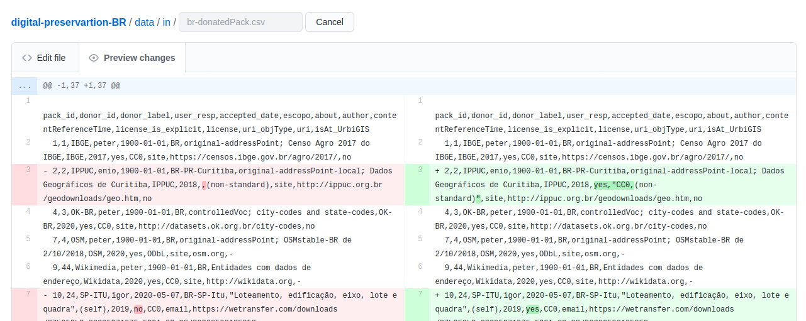

# Atualizando o git manualmente

Quem não tem aplicativo git instalado ou não esta acostumado a usar, pode experimentar o processo manual... Que não deixa de ser trabalhoso, pois queremos garantir que a verificação das diferenças (diff) será realizada pelo ser humano.

Depois de baixar arquivos CSV da planilha Google-docs, com *"salvar como  CSV"*, realizar o seguinte procedimento. Supor planilha `donatedPack.csv`. Na interface do portal Github realizar o seguinte passo-a-passo:

1. Navegar até https://github.com/digital-guard/preserv-BR/blob/main/data/donatedPack.csv;

2. Clicar no ícone de lápis, entrando no modo edição;

3. Selecionar tudo, deletando todo o conteúdo;

4. Abrir um editor de texto decente (UTF8 linux) com texto CSV integral baixado (item 1), copiar/colar esse novo texto. Em seguida  clicar na aba superior de *"Preview changes"*. É o momento critico para decidir se foi tudo bem! (abaixo imagem exemplo);

5. (se tudo bem) comentar o que fez no commit e clicar no botão "commit changes". Usuários não-experts em *git* podem editar diretamente.

