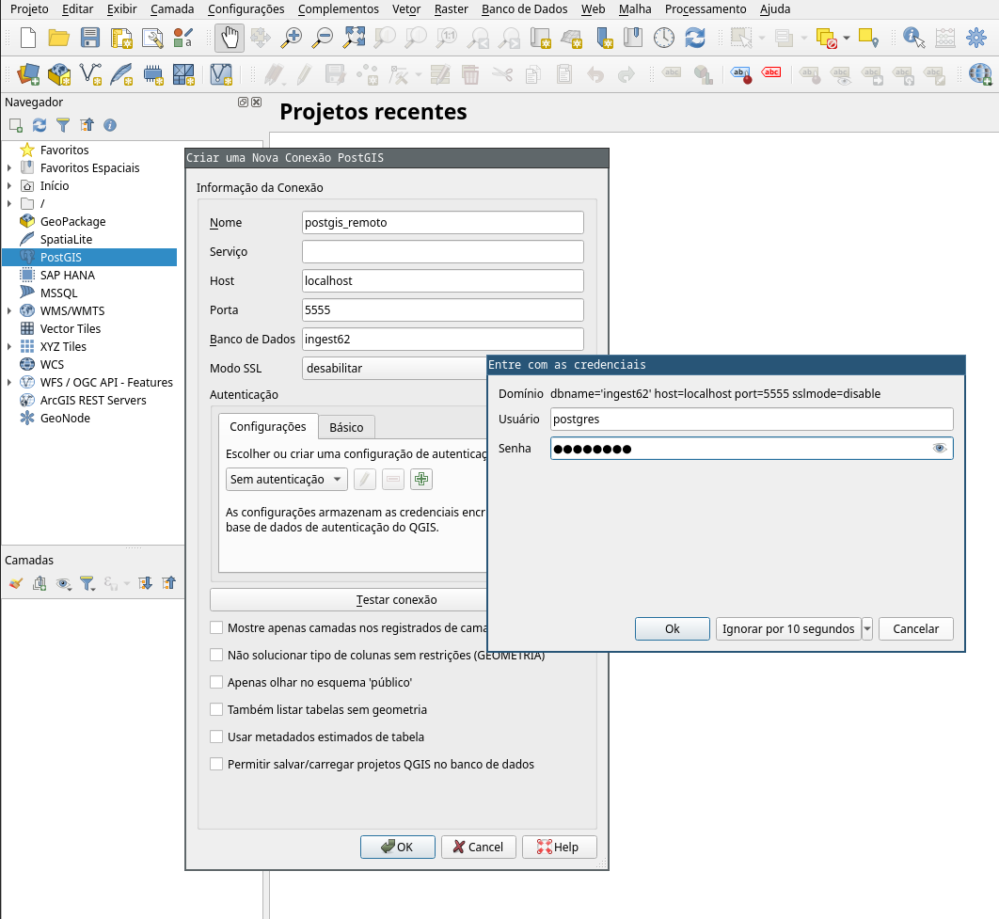

# Conectar em um PostGis remoto com SSH e QGis

## Passo 1: Local Port Fowarding

### Para usários de sistema unix

Em um terminal, redirecionar a porta do servidor onde roda o banco de dados (atualmente 5432) para uma porta local via túnel SSH:

```sh
ssh -L [porta_máquina_local]:localhost:[porta_banco_de_dados] nome_de_usuario@ipv4_ou_ipv6_do_servidor
```

ou, se usar chaves SSH:

```sh
ssh -L [porta_máquina_local]:localhost:[porta_banco_de_dados] nome_de_usuario@ipv4_ou_ipv6_do_servidor -i caminho_da_chave
```

Por exemplo, para acessar um banco de dados na porta 5432 de 192.0.2.0 na porta local 5555:

```sh
ssh -L 5555:localhost:5432 user@192.0.2.0
```


### Para usuários de windowns

...


## Passo 2: Adicionando e usando no QGIS

No navegador lateral clicar com o botão direito do mouse em _PostGIS_ (ícone de elefante) e em _nova conexão_. Em seguida, preencher os campos da nova conexão:

* Nome: postgis_remoto (por exemplo)
* Host: **localhost**
* Porta: **5555** (porta_máquina_local)
* Banco de dados: **ingestXX** (nome da base de dados)

Depois de preencher as informações da conexão, clicar no botão _OK_ e adicionar _usuário_ e _senha_ (ambos iguais a _postgres_), veja a imagem a seguir:





Com isso todos os _schemas_ existentes na base de dados serão listados no navegador lateral:


Ao expandir algum dos _schemas_ existentes, as tabelas com geometrias estarão disponíveis para serem adicionadas como camadas ao projeto. No exemplo a seguir, _feature_asis_ foi adicionada sobre o OpenStreetMap:


## Usando a filtragem para avaliar layer ingeridos

Cada ingestão realizada gera um _file_id_, como mostra o output da ingestão de um layer _nsvia_:


O _file_id_ pode ser utilizado em conjuto com a ferramenta de filtro do QGIS para visualizar apenas as geometrias de um layer de interesse dentre os disponiveis na tabela `ingest.feature_asis`:


Para avaliar as _features_ que a ingestão encontrou problemas, usar a tabela ingest.feature_asis_discarded.
