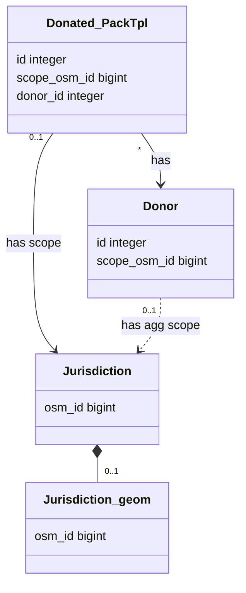
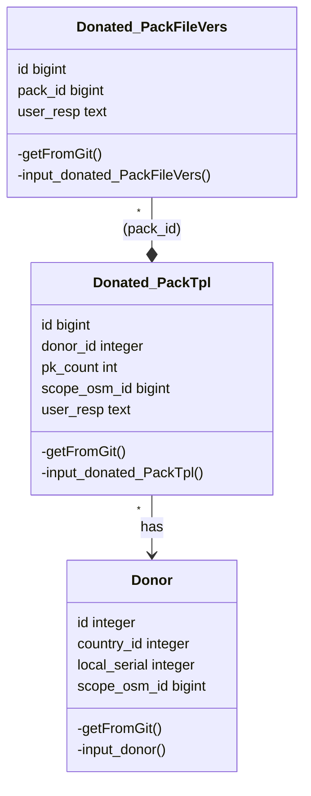
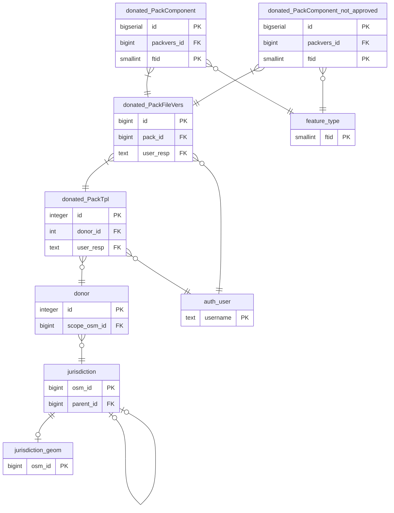

## Diagrama DL03t_main

[Diagramas UML de classes](https://en.wikipedia.org/wiki/Class_diagram). Conforme **convenções** semânticas UML e detalhes [visuais Mermaid](https://mermaid-js.github.io/mermaid/#/classDiagram).

## Donated_PackTpl e Jurisdiction

## Donated_PackTpl e seus componentes

----

## Implementação

Os relacionamentos entre as classes foram implementados através de tabelas e chaves do [Modelo Relacional](https://en.wikipedia.org/wiki/Relational_model) (SQL), que ficam mais evidentes em [diagramas clássicos de Entidade-Relacionamento do tipo pé-de-galinha](https://en.wikipedia.org/wiki/Entity%E2%80%93relationship_model#Crow's_foot_notation).

<!--
    class Donated_PackFileVers {
        id:bigint
        hashedfname:         text  
        pack_id:                bigin
        pack_item:              integer
        pack_item_accepted_date: date
        kx_pack_item_version:   integer
        user_resp:              text  
        info:                   jsonb
        -input_donated_packfilevers()
        insert_donor_pack()
    }

-->
