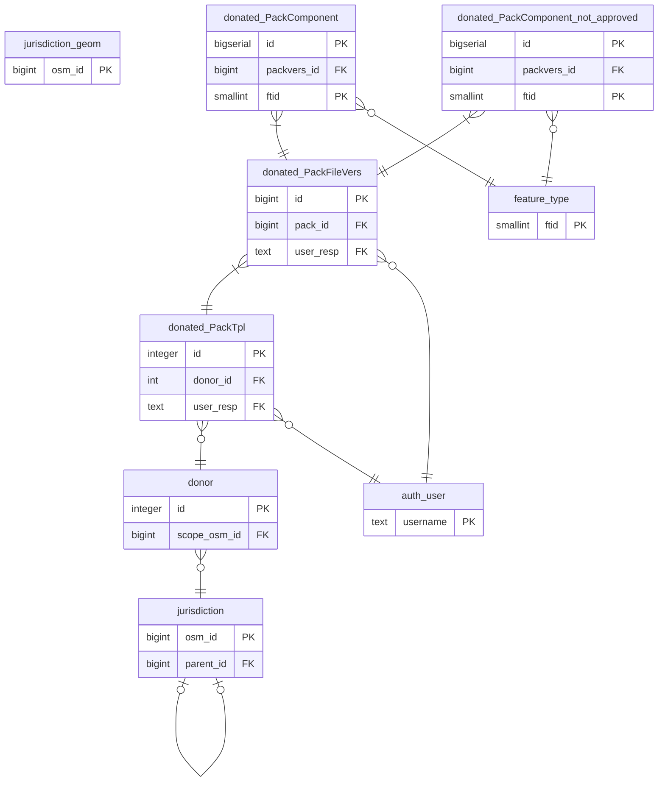

## Diagrama DL03t_main

Diagrama:

```mermaid
erDiagram
    jurisdiction |o--o| jurisdiction : ""
    jurisdiction_geom
    auth_user
    donor }o--|| jurisdiction : ""
    donated_PackTpl }o--|| donor : ""
    donated_PackTpl }o--|| auth_user : ""
    donated_PackFileVers }|--|| donated_PackTpl : ""
    donated_PackFileVers }o--|| auth_user : ""
    feature_type
    donated_PackComponent }|--|| donated_PackFileVers : ""
    donated_PackComponent }o--|| feature_type : ""
    donated_PackComponent_not_approved }|--|| donated_PackFileVers : ""
    donated_PackComponent_not_approved }o--|| feature_type : ""

    jurisdiction {
        bigint osm_id PK
        bigint parent_id FK
    }
    jurisdiction_geom {
        bigint osm_id PK
    }
    auth_user {
        text username PK
    }
    donor {
        integer id PK
        bigint scope_osm_id FK
    }
    donated_PackTpl {
        integer id PK
        int donor_id FK
        text user_resp FK
    }
    donated_PackFileVers {
        bigint id PK
        bigint pack_id FK
        text user_resp FK
    }
    feature_type {
        smallint ftid PK
    }
    donated_PackComponent {
        bigserial id PK
        bigint packvers_id FK
        smallint ftid PK
    }
    donated_PackComponent_not_approved {
        bigserial id PK
        bigint packvers_id FK
        smallint ftid PK
    }
```
